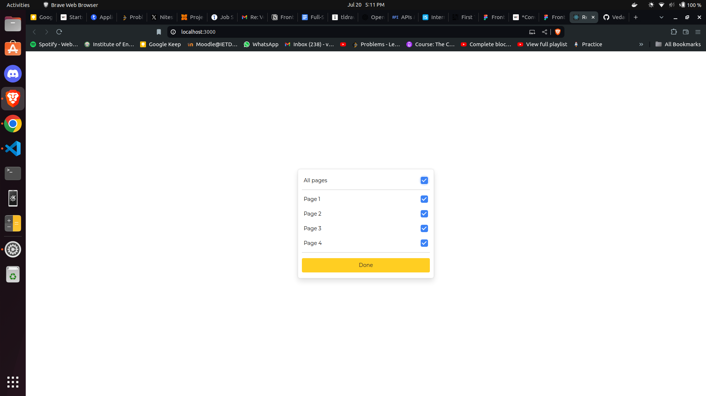
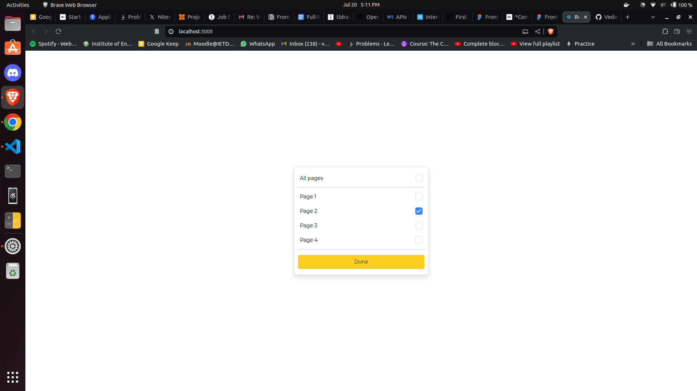

# React Components Project

This project demonstrates the implementation of multiple React components: Button, Dropdown, and Layout. These components are styled using CSS modules to ensure modularity and encapsulation of styles.

DeployedLink -> https://ellty-assignment-seven.vercel.app/

## Screenshots

